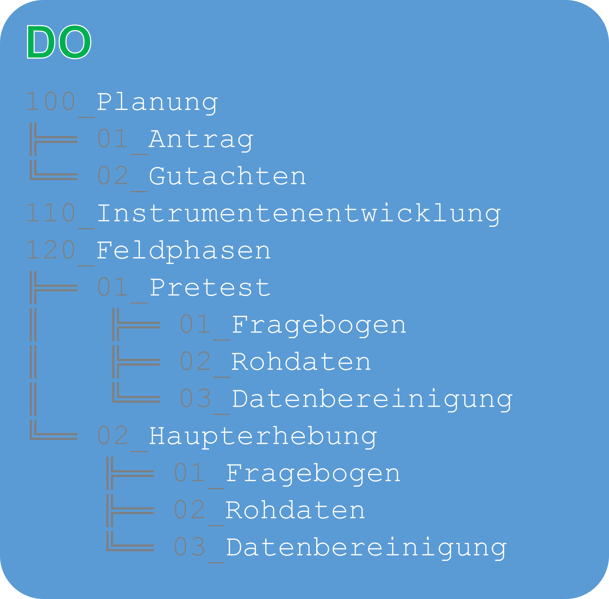
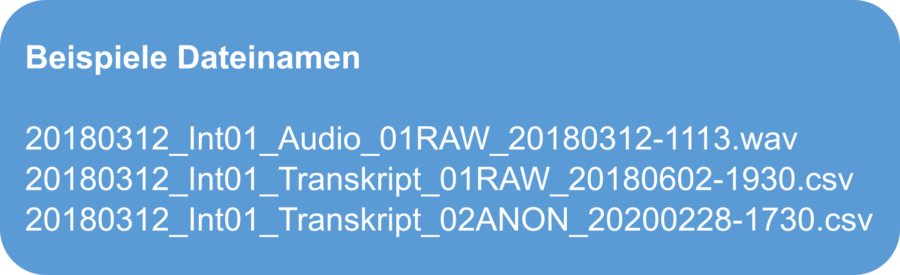

<!--
icon: ../resources/logos/C3RDM_EN_V3_transparent_w1156.png
-->

---
# Einführung in den Themenblock 3: "Organisation Daten"

Während [Themenblock 1: Leitfragen Speicher](./0110_storage-key-questions_DE.md) die Speicherbedarfe und [Themenblock 2: Speicherlösungen](./0120_storage-solutions_DE.md) deren technische Umsetzung behandelt, geht es nun eher um organisatorische Aspekte.

Die **Organisation und Dokumentation** der Datengenese, Datenanalyse und Datenspeicherung und der damit zusammenhängenden Prozesse sind entscheidende Aufgaben im Forschungsdatenmanagement. Durch systematische Organisation und Dokumentation werden Prozesse transparent gemacht und durch Standardisierung vereinfacht. Dies erleichtert nicht nur die effiziente Zusammenarbeit in Teams und Arbeitsgruppen, sondern es macht viele gespeicherte Forschungsdaten überhaupt erst verständlich. Gut strukturierte und dokumentierte Datensätze können Sie selbst auch nach Jahren noch verstehen und diese bei Bedarf ohne zusätzliche Erläuterungen Dritten zur Nachnutzung zur Verfügung stellen. In diesem Themenblock geht es deshalb um grundlegende Maßnahmen und Empfehlungen zur Organisation und Dokumentation von Forschungsdaten.

(weitere Kapitel sind derzeit noch in Entwicklung, vgl. [Überblicksseite der Themenblöcke](https://www.ilias.uni-koeln.de/ilias/goto_uk_fold_4178361.html))

---
# Metadaten

Selbst eine kursorische Beschäftigung mit Forschungsdatenmanagement zeigt schnell, dass Metadaten dabei ein zentrales Thema sind, das deshalb hier auch in verschiedenen Themenblöcken behandelt wird. An dieser Stelle geht es zunächst um einen grundlegenden Überblick. Was ist also mit Metadaten gemeint?

Theoretisch sind Metadaten:

- Daten über Daten
- oft auch: Daten über Objekte

Daten, die andere Daten (oder auch Objekte im ganz allgemeinen Sinne) beschreiben – das mag auf den ersten Blick  eher optional bzw. möglicherweise hilfreich erscheinen, aber weniger als essentiell. Denn eigentlich entscheidend sind ja die Daten (oder Objekte) selbst, oder? Sehen wir uns das an einem einfachen Beispiel an: Etiketten (Metadaten) der Dosen (Objekte) im Vorratsschrank.

Stellen Sie sich vor es ist Pandemie und Sie dürfen die Wohnung nicht verlassen. Glücklicherweise haben Sie eine Vorratskammer voller Konserven, aus denen Sie abends etwas Köstliches zubereiten möchten. Leider hatten Sie aber vor kurzem einen Wasserschaden in der Vorratskammer, bei dem zwar die Dosen selbst und deren Inhalt heil geblieben sind, aber alle Etiketten fein säuberlich heruntergewaschen wurden. Natürlich werden Sie nicht verhungern – der Inhalt der Dosen ist immer noch da und genießbar. Ihr Rezept können Sie aber vergessen, weil Sie höchstens durch Zufall beim Öffnen der Konserven die passenden Zutaten finden werden – und unmöglich alle Dosen gleichzeitig öffnen und verbrauchen können.

Metadaten begegnen Ihnen überall, z.B.:

- Bibliographische Angaben (Hier ist der Buchrücken das Äquivalent zum Dosenlabel. Ohne könnten Sie immer noch Shakespeare lesen, würden Sie ihn je finden in der riesigen Bibliothek voller leerer Buchrücken)
- alle Songinfos von mp3 oder anderen Mediendateien (und ebenso die Auswahllisten bei Streamingdiensten werden hierdurch gespeist)
- jede Bestellseite von Onlineshops samt der Rezensionen sind letztlich Metadaten der Artikel

An den Beispielen wird deutlich, wie sehr wir in (insb. auch wissenschaftlichen) Alltagssituationen von Metadaten umgeben und auf diese angewiesen sind. In unserem Gedankenexperiment gerade wurde deutlich, wie wichtig solche beschreibenden Daten auch für unsere Forschungsdaten sind. Ohne diese können Dritte oft gar nicht oder nur mit erheblichem Aufwand:

- verstehen, was wir gemacht haben;
- wissen, wo etwas zu finden ist;
- herausbekommen, welche Datei die letzte gültige Version ist.

Sofern Sie nicht mit einem außergewöhnlich guten Gedächtnis ausgestattet sind, geht es Ihnen vermutlich selbst wie vielen Kolleg:innen und Sie wissen unter Umständen nach dem viertel-, halben- oder ganzen Jahr, das zwischen Datenerhebung und einer ausführlicheren Analyse vergeht, nicht mehr, was Sie genau gemacht haben oder welche Ihrer vielen Messungen die Beste war (vielleicht war das nicht die letzte sondern die 89. von 216?). Daher folgen nun einige Empfehlungen, um diesem Informationsverlust frühzeitig vorzubeugen.

---
# Daten strukturiert Speichern

Metadaten kommen im Kontext von Forschungsdatenmanagement praktisch überall dort zum Einsatz, wo Daten strukturiert gespeichert und dokumentiert werden müssen. Dies sind u.a.:

- **Verzeichnisstrukturen und Dateinamen**: statt kryptisch fortlaufender Nummern oder Zeichenketten sind hier sprechende Namen nach einer festgelegten Nomenklatur zu empfehlen.
- **Eingebettete Metainformationen** kennen Sie vermutlich vor allem von Bilddaten (ihre Digitalkamera/ihr Smartphone hält in den Eigenschaften der Datei u.a. fest, wo und wann die Aufnahme gemacht wurde).
- Textuelle Formen der **Dokumentation**:

  - **README**: Eine simple Textdatei (.txt oder häufig auch Markdown .md) stellt eine sehr einfache Möglichkeit der Dokumentation dar. Damit können z.B. Nomenklaturregeln für Dateinamen direkt im Verzeichnis hinterlegt werden, damit sich alle Teammitglieder einheitlich daran halten und Dritte die Bezeichnungen verstehen können. Oder Sie können die Inhalte einzelner Verzeichnisse eindeutiger und ausführlicher beschreiben, als es zeichenbeschränkte Ordertitel erlauben.
  - **Forschungstagebücher** können ausführlicher den Forschungs- und Entscheidungsprozess sowie verwendete Methoden festhalten.
  - **DMP** steht für Datenmanagementplan und ist ein formalisiertes Planungs- und Dokumentationsdokument für alle Schritte im Forschungsdatenmanagement (ausführlichere Darstellung in einem gesonderten Themenblock, derzeit noch in Entwicklung, vgl. [Überblicksseite der Themenblöcke](https://www.ilias.uni-koeln.de/ilias/goto_uk_fold_4178361.html))
- **Metadatenschemata**: Metadaten können hohe Komplexitätsgrade erreichen, für die es spezifische Standards gibt und die in sogenannten Metadatenschemata definiert werden (ausführlichere Darstellung in einem gesonderten Themenblock, derzeit noch in Entwicklung, vgl. [Überblicksseite der Themenblöcke](https://www.ilias.uni-koeln.de/ilias/goto_uk_fold_4178361.html)). Eine bekannte Anwendung sind unterschiedliche Zitationsstile (z.B. MLA, Chicago oder Manuskriptrichtlinien von Zeitschriften) mit klaren Nomenklaturregeln für die Erstellung des Literaturverzeichnisses, die in der Regel ineinander überführbar sind, weil die jeweiligen Datenfelder klar festgelegten Inhalts sind.

Im Folgenden konzentrieren wir uns auf die **Grundlagen der Dokumentation durch Ordnerstrukturen und Dateiorganisation**. Wie genau beispielsweise eine Ordner- und Dateistruktur für eine Arbeitsgruppe aussehen sollte und wie sie am besten so dokumentiert wird, dass auch alle Beteiligten sich an die gemeinsamen Regeln halten, ist sehr stark abhängig vom Kontext: Wie viele Personen arbeiten zusammen, auf welche Weise, mit welcher Art von Daten, auf welcher Speichertechnik in welcher Phase, mit welchem Ziel, mit welchen Gewohnheiten, usw. Deshalb gibt es nicht das eine Schema, den einen Workflow, die beste Empfehlung sondern eher eine Reihe von Vorschlägen und beachtenswerten Hinweisen.

Eine Empfehlung ist aber nach unserer Erfahrung doch universell: Machen Sie sich früh (am besten bevor es größere Datenmengen gibt) Gedanken darüber, wie Sie sich organisieren wollen und kommunizieren Sie die gemeinsam festgelegten Konventionen. Wenn sich erst einmal eine gewachsene Struktur entwickelt hat, ist es schwierig und aufwändig diese nachträglich zu ändern – auch wenn sie sich als hochgradig ineffizient erweist.

---
## Ordner

In den meisten Kontexten und Dateisystemen werden Dateien in einer klassischen, hierarchischen Ordnerstruktur abgelegt. Grundsätzlich sind für die Metadaten der Ordner folgende Eigenschaften günstig (obwohl nicht immer leicht umsetzbar):

- klare, selbsterklärende Struktur
- wenige Ebenen
- Konsistenz.

Was eine **klare, selbsterklärende Struktur** ist hängt sehr von den Umständen und Konventionen ab und kann stark von der Fachdisziplin oder auch einfach den Arbeitsgewohnheiten einer Arbeitsgruppe beeinflusst sein. Die Struktur geht im Idealfall vom allgemeinen (Überordner) zum spezielleren (Unterordner), verzweigt sich dabei aber nicht in so viele Ebenen, dass die Baumstruktur unüberschaubar und der Pfad zu einer Datei zu lang wird.

Idealerweise verstehen selbst Außenstehende die Struktur oder können sich diese zumindest erschließen. Oft wird das nur durch eine Dokumentation (README) realistisch zu erreichen sein. Es kann eine gute Idee sein, eine für alle Beteiligten sinnvolle Struktur an einem möglichst allgemeinen Beispiel zu entwickeln und diese dann für alle Projektteile mit möglichst wenig individuellen Abweichungen beizubehalten. Auch hier hilft eine gute Beschreibung als Erinnerungsstütze oder zur Einarbeitung neuer Teammitglieder.

In hierarchischen Ordnerstrukturen, in denen Ebenen jeweils wieder Unterebenen haben können, lässt sich Komplexität in der Projektstruktur durch eine entsprechende Komplexität der Ordnerstruktur abbilden. Zu viele Ebenen verlangsamen aber die Navigation innerhalb der Hierarchie und zu lange Dateipfade können technische Probleme verursachen. Daher lautet die Empfehlung: **so wenige Ebenen wie möglich** bzw. nur so viele wie unbedingt nötig zu verwenden. Andererseits ist es auch nicht hilfreich, alle Dateien in einen großen Ordner oder dutzende Ordner in einen Unterordner zu packen.

Die Eigenschaft **Konsistenz** ist noch am einfachsten universell zu fassen. Unabhängig von der Sprache oder Terminologie der Ordnerbenennung sollte auf die konsequente Einhaltung der gewählten Konventionen geachtet werden. Das geht wieder am besten durch eine Dokumentation, in der eindeutig für alle Beteiligten festgelegt wird, ob z.B. `v.X` `vers.X` oder `Version_X` zur Kennzeichnung einer Versionsnummer verwenden werden soll.

Betrachten wir das an einem Beispiel:

---
### Ordner dos ...

Im Folgenden werfen wir einen Blick auf eine Ordnerstruktur, die sich bemüht alle drei Kriterien (klare Struktur, wenige Ebenen, Konsistenz) für ein sozialwissenschaftliches Projekt zu erfüllen:

Zunächst einmal fällt die erzwungene Sortierung durch die **initiale Nummerierung** im Ordnernamen auf (graue Schrift). Diese kann nicht universell für jedes Dateisystem empfohlen werden: Wenn die Nummerierung  funktioniert, ist sie sehr praktisch. Es kann aber passieren, dass ein Dateisystem diese auf unerwartete Art sortiert, z.B. `1` > `10` > `2` – weil jede Position einzeln betrachtet wird (was evtl. durch eine initiale Null umgangen werden kann: `01` > `02` > `10`).

Auf der Hauptebene werden klar definierte Projektphasen (`Planung`, `Instrumentenentwicklung` und `Feldphasen`) unterschieden, die eindeutig voneinander abgetrennte Inhalte haben sollten. Hier zeigt sich aber selbst bei dieser übersichtlichen Struktur, dass es nicht immer klar ist, wo eine Datei später hingehört: Die Entwicklung des Instruments (sprich: Fragebogens) kann viele Schritte beinhalten, darunter auch Recherche nach und Vergleich mit bestehenden Instrumenten usw. Oft muss das Instrument auch mit allen am Projekt beteiligten abgesprochen werden, was diverse Überarbeitungsversionen bedeuten kann. All dies in Unterordnern eines entsprechenden Ordners (hier `Instrumentenentwicklung`) zu sichern kann sehr sinnvoll sein. Das Resultat dieser Arbeit ist dann i.d.R. ein erstes Instrument, das anschließend in einem sogenannten Pretest darauf geprüft wird, ob es die gewünschten Messeigenschaften besitzt. Dem Folgt oft eine Anpassung (und ggf. noch eine oder mehrere weitere Pretestschleifen), bis das für die tatsächliche Haupterhebung verwendete Instrument entsteht. Es gibt also mehrere Fragebogenversionen, von denen mehrere im Feld (Pretest und Haupterhebung) gewesen sein können.

Nur: wo sollen die Fragebögen gespeichert werden? Gehören sie alle in `Instrumentenentwicklung`, weil dort ja auch die ganze Vorarbeit gespeichert ist? Oder sollten Sie – wie hier vorgeschlagen – in der entsprechenden Feldphase (`Pretest` bwz. `Haupterhebung`) in der jeweils endgültigen Version abgelegt werden? Da (etwas vereinfacht) der Fragebogen die Antworten und damit die Daten erzeugt, die Daten also im Prinzip ohne den Fragebogen nicht verständlich sind, wurde hier entschieden, die jeweilige Fragebogenversion in der entsprechenden Feldphase zu speichern – die Entscheidung könnte aber auch anders fallen. Das Beispiel verdeutlicht, wie wichtig es ist gemeinsam im Projekt eine Logik zu entwickeln, diese zu kommunizieren und zu dokumentieren.

Auch gibt es auf den ersten Blick eine Parallelstruktur zwischen `Pretest`und `Haupterhebung`, weil diese Unterordner gleichen Namens beinhalten (`Fragebogen`, `Rohdaten` und `Datenbereinigung`). Durch die Struktur ist aber eindeutig festgelegt, wo welche Daten hingehören – also die Rohdaten des Pretest in `01_Pretest/02_Rohdaten`, die der Hauptbefragung hingegen in `01_Hauptbefragung/02_Rohdaten`. Auch hier ist es wichtig, dass alle Beteiligten die Logik verstehen, die hinter dem Ordnungssystem liegt. Würde in der bestehenden Struktur jemand im Projekt das gesamte Dateisystem nach `Rohdaten` durchsuchen und dann unhinterfragt mit dem zuerst gefundenen Datensatz arbeiten, würde sehr wahrscheinlich mit dem falschen Datensatz gearbeitet werden.

---
### ... and don'ts

Jetzt werfen wir einen Blick auf eine Ordnerstruktur, wie sie typischerweise entsteht, wenn verschiedene Personen ohne Absprachen nach je ihrer eigenen Logik und Konventionen im Laufe der Zeit eine "Ordnung" wachsen lassen:

Die Namenskonventionen auf der Hauptebene sind hier nicht stringent: Mal wird eine initiale Zahl verwendet, mal nicht. Schwerwiegender ist aber, dass einmal thematisch geordnet wird (Befragung, Antrag und Daten) und einmal nach Personen (John Doe). Offenbar war John zu Beginn des Projekts mit dem Pretest beauftragt – und hat alle Daten dazu in seiner Logik in einem Ordner mit seinem Namen gespeichert. Dabei ist die Unterscheidung in `rohdaten` und `rohdaten(neu)` nicht wirklich erhellend: sind es hier Rohdaten zu verschiedenen Projekten, Befragungen, Zeitpunkten, vielleicht verschiedene Formate, oder sind die "neuen" um Fehler korrigiert?

Zusätzlich hat sich später im Projekt eine Parallelstruktur in verschiedenen Unterordnern entwickelt, so dass `Pretest` mehrfach vorkommt – unter `Daten`, aber auch unter `John Doe`. Im Gegensatz zum empfohlenen Beispiel links, bei dem es auch Parallelstrukturen gibt, wird hier aber nicht durch die jeweils übergeordneten Ordner verdeutlicht, wo welche Daten hingehören. So werden unter Umständen verschiedene Personen einer individuellen Logik nachgehen, einmal in dem einen, dann in dem anderen Ordner arbeiten. Wo die aktuellen und gültigen Versionen liegen, ist dadurch nicht mehr ersichtlich. Damit ist viel unnötige Arbeit und vielleicht sogar gravierender Datenverlust gepaart mit großer Fehleranfälligkeit vorprogrammiert.

---
## Dateien

Für die Dateibenennung gelten die gleichen Prinzipien wie für Ordnerstrukturen, um den Überblick zu behalten, Fehlern vorzubeugen und die Zusammenarbeit mit Dritten zu erleichtern:

- klare, selbsterklärende Nomenklatur
- ideal: sprechende Kürzel
- Konsistenz
- Dokumentation (z.B. README.txt)

Während bei Ordnern das Hauptaugenmerk auf der hierarchischen Struktur von Über- und Unterordnern liegt, ist bei Dateinamen die Binnenstruktur der Bezeichnung entscheidend. Je **klarer und selbsterklärender die Nomenklatur** ist, desto leichter fällt die Orientierung zwischen den vielen Dateien, die über Jahre in Projekten anfallen. Idealerweise kommen dabei **sprechende Kürzel** zum Einsatz, so dass ein möglichst kurzer Dateiname dennoch viel leicht verständliche Information beinhaltet.

Damit diese Kürzel auch von allen verstanden werden, sollte die **Dokumentation** nicht nur eine Auflistung der Bestandteilen von Dateinamen in verschiedenen Kontexten enthalten, sondern auch ein Verzeichnis über Abkürzungen (z.B. "FDM" = "Forschungsdatenmanagement").

Die Auflistung der Bestandteile von Dateinamen ist bestenfalls als sogenanntes **kontrolliertes Vokabular** zu verstehen (ausführlichere Darstellung in einem gesonderten Themenblock, derzeit noch in Entwicklung, vgl. [Überblicksseite der Themenblöcke](https://www.ilias.uni-koeln.de/ilias/goto_uk_fold_4178361.html)). Dabei handelt es sich um eine klar definierte Liste mit ausgewählten Kategorien, die möglichst disjunkt (alle Kategorien sind überschneidungsfrei) und erschöpfend (alle möglichen Ausprägungen, die bezeichnet werden können, fallen in eine Kategorie) sein sollen. Legen sich alle Beteiligten auf eine solche Liste fest, ist die Gefahr von Parallelstrukturen in den verwendeten Begrifflichkeiten und inkonsistenten Benennungen deutlich reduziert. Ein Beispiel für ein sehr bekanntes fachspezifisches kontrolliertes Vokabular aus dem Bereich der Medizin ist der [ICD-10](https://www.bfarm.de/DE/Kodiersysteme/Klassifikationen/ICD/ICD-10-GM/_node.html) zur Klassifizierung von Diagnosen.

Wir sehen uns im Folgenden ein paar einfache Beispiele an, die als Inspiration zu verstehen sind.

---
### Datei: Beispiel qualitatives Interview

Versetzen wir uns in die Lage von Forschenden, die qualitative Interviews führen. Unter den anfallenden Daten sind Audioaufzeichnungen der resultierenden Gespräche und auf dieser Grundlage entstehende Transkripte. Weil gerade in solchen Interviewsituationen personenbezogene Daten anfallen können, die unter die DSGVO fallen, wird es oft notwendig sein, die original Transkripte (Rohdaten) zu anonymisieren, um diese beispielsweise mit Projektpartner:innen austauschen oder später Dritten zur Nachnutzung zur Verfügung stellen zu können. Ein Ausschnitt aus dem Ordner mit den Daten könnte etwa so aussehen:

In unserem Beispiel liegen die Audiodateien im sehr verbreiteten WAVE-Format (.wav) vor, die Transkripte beinhalten neben dem Text auch noch einige Zusatzinformationen (z.B. Zeitstempel) und sind als strukturierte Daten (sprich: Tabelle) im kommaseparierten Format (.csv) abgelegt. Die Eignung verschiedener Dateiformate für eine digitale Langzeitarchivierung ist eine sehr komplexe Angelegenheit, auf die wir an anderer Stelle etwas ausführlicher eingehen (derzeit noch in Entwicklung, vgl. [Überblicksseite der Themenblöcke](https://www.ilias.uni-koeln.de/ilias/goto_uk_fold_4178361.html)).

Es gibt eine Reihe möglicher Informationen, die als sinnvoller Bestandteil des Dateinamens in Frage kommen. Dies kann beispielsweise das Datum des Interviews sein oder ein Kürzel für die Person, die das Interview durchgeführt hat. Nützlich auf dieser Ebene ist ggf. auch der Bearbeitungsstatus einer Datei und ein Zeitstempel der letzten Bearbeitung, um verschiedene Versionen voneinander unterscheidbar zu machen.

---
### Datei: Beispiel qualitatives Interview – Struktur

Wir können sehen, dass sich die Dateinamen aus verschiedenen Segmenten zusammensetzen, die jeweils durch einen Unterstrich (`_`) voneinander getrennt sind. Die Segmente stehen dabei immer an der gleichen Position innerhalb des Dateinamens. Damit ergibt sich eine einfache, immer gleiche Struktur:

Sehen wir uns die einzelnen Bestandteile genauer an:

1. **Datum Interview**: Die Dateinamen beginnen mit dem Datum, zu dem das Interview geführt wurde – und zwar im Format Jahr, Monat, Tag (JJJJMMTT). Bei einer alphanumerischen Sortierung werden die Interviewdateien dann in chronologischer Reihenfolge ihrer Entstehung geordnet.
2. **Interviewer-ID**: Oft ist es wichtig zu wissen, wer ein Interview durchgeführt hat, und diese Information ist hier direkt im Dateinamen durch ein Kürzel hinterlegt. Das Format ist die Abkürzung `Int` für Interviewer:in, direkt gefolgt von einer zweistelligen Nummer (der eigentlichen ID).
3. **Datentyp**: Dies gibt an, welcher Typ Daten in der Datei zu finden ist. Hier werden die Audiodateien (`Audio`) von den Transkripten (`Transkript`) unterschieden. Im abgebildeten Fall ist die Information redundant, weil sich das auch aus dem Dateityp (.wav bzw. .csv) ablesen lässt. Sollten jedoch weitere Dateien wie z.B. ein Feldprotokoll zu einem Interview ebenfalls in einer .csv-Datei abgespeichert werden, dann ist eine Unterscheidung verschiedener Datentypen sinnvoll.
4. **Bearbeitungsstatus**: Diese Information dient hier zur Kennzeichnung des Verarbeitungszustands. Unterschieden werden Rohdaten (`RAW`) von anonymisierten Daten (`ANON`). Den Labeln ist jeweils eine Nummer vorangestellt (`01RAW` und `02ANON`), um bei einer Sortierung untereinander die Bearbeitungsstatus in der Reihenfolge zu halten, in der sie anfallen (zuerst die Rohdaten, dann die anonymisierten).
5. **Zeitstempel**: Der Dateiname schließt mit einem Zeitstempel – und zwar dem Zeitpunkt der letzten Bearbeitung. Diese liegt im alphanumerisch sortierfreundlichen Format vor von größeren zu kleineren Zeiteinheiten (JJJJMMTT-HHMM für Jahr, Monat, Tag, Stunde, Minute); das Minus zwischen Datum und Zeit sorgt für bessere Lesbarkeit. Das endständige Datum erlaubt die Versionierung der Bearbeitung. Gibt es später mehrere Versionen einer Datei, weil diese immer wieder bearbeitet wurde, erscheinen diese untereinander in der Reihenfolge ihrer Bearbeitungszeit. Festgehalten wird dabei das im Dateisystem automatisch festgehaltene Änderungsdatum (wie es im Dateimanager, z.B. im Windows Explorer, angezeigt wird) und nicht die ungefähre Uhrzeit der notorisch falsch gehenden Küchenuhr. Nur so ergibt sich gleichzeitig eine Konsistenzkontrolle: Weicht der Zeitstempel des Änderungsdatums der Datei von der Zeitangabe im Dateinamen ab, dann gab es evtl. eine nicht beabsichtigte Änderung oder irgendeinen Konflikt (z.B. bei einer Synchronisation).

Der Dateiname ist so komplett standardisiert und durchstrukturiert. Hinter Format, Anordnung und Relevanz eines jeden Segments steckt ein sorgfältiger Abwägungsprozess. Die Entscheidungen können projektspezifisch durchaus anders ausfallen: Vielleicht ist es unerheblich, wer das Interview geführt hat. Oder es ist für die Arbeitsprozesse viel wichtiger, nach Interviewer-ID zu sortieren als nach dem Datum des Interviews.

Wie genau die Konvention sinnvoll den Forschungsprozess abbildet und effektiv funktioniert, hängt letztlich davon ab, wer wie zu welchem Zweck was mit den Daten macht. Die beste Konvention ist dagegen nutzlos, wenn sie nicht klar dokumentiert ist sowie im Team kommuniziert und konsequent angewendet wird.

---
### Datei: Beispiel qualitatives Interview – Dokumentation

Eine einfache Möglichkeit die Nomenklaturregeln für die Dateibenennung zu dokumentieren ist eine README-Datei. Darin können die wichtigsten Informationen und Regeln für einzelne Ordner, eine komplette Ordnerstruktur oder für ganze Workflows festgehalten werden. Für unser Beispiel der Dateibenennung wäre es z.B. wichtig, die Logik der Struktur, die Formate und Inhalte der einzelnen Segmente klar festzuhalten. Das kann (im Auszug) dann etwa so aussehen:

![Oben: Abbildung mit Beispielen für Dateinamen für qualitative Interviews. Abgebildet sind die Namen von drei Dateien: Eine Audiodatei im WAVE-Format und zwei csv-Dateien mit Transkriptionen in unterschiedlichen Bearbeitungsstatus. Die Dateinamen beinhalten durch Unterstrich voneinander getrennte Segmente. Diese sind: Datum des Interviews, Interviewer ID, Datentyp, Bearbeitungsstatus und ein Zeitstempel. Unten: Auszug aus einer README-Datei. In der ersten Zeile wird formalisiert die Struktur der Nomenklatur dargestellt in Form der einzelnen Segmenten. Darunter werden einzelne dieser Segmente (Bearbeitungsstatus und Zeitstempel) genauer beschrieben über mögliche Begriffe oder Formate für z.B. Zeitangaben.](../resources/figures/files_DE_0030_nomenclature-interview-documentation_w1920.png "Dateien - DE - 0030 - Nomenklatur, Interview, Dokumentation, Lizenz: CC0")

Der vorliegende Auszug aus der README-Datei zeigt eine formalisierte Darstellung der einzelnen, inzwischen bekannten Segmente von Dateinamen, die jeweils mit Unterstrichen voneinander getrennt sind:

**[DatumInterview]\_[InterviewerID]\_[DatenTyp]\_[Bearbeitungsstatus]\_[Zeitstempel]**

Zusätzlich werden Angaben zu den einzelnen Segmenten gemacht. Für den `Bearbeitungsstatus` sind genau zwei verschiedene Zustände vorgesehen, die auf eine vorgegebene Weise auszuzeichnen sind. Rohdaten erhalten die Kennzeichnung `01RAW`, anonymisierte Daten `02ANON`. Für den `Zeitstempel` hingegen wird das zu verwendende Datumsformat beschrieben mit `JJJJMMTT-HHMM`.

---
### Datei: Beispiel Wasserproben – Dokumentation

Je nach Art der Daten oder Workflows, können selbst innerhalb eines Projekts oder einer Arbeitsgruppe für verschiedene Aspekte unterschiedliche Konventionen erforderlich sein. Im folgenden Beispiel zur Benennung der Dateinamen für mikroskopische Bilddaten von Wasserproben, die mehrere Bearbeitungsstatus durchlaufen (z.B. Auswahl von Ausschnitten und anschließendes Einfärben), wird eine alternative Kennzeichnung der Versionierung verwendet:

![Oben: Abbildung mit Beispielen für Dateinamen für mikroskopische Bilddaten von Wasserproben. Abgebildet sind die Namen von drei Dateien. Die Dateinamen beinhalten durch Unterstrich voneinander getrennte Segmente. Diese sind: Datum der Probenentnahme, Pobentyp und Proben-ID, Analyseinstrument, Versionsnummer der Bearbeitung und Beschreibung des vorliegenden Bearbeitungsstatus. Unten: Auszug aus einer README-Datei. In der ersten Zeile wird formalisiert die Struktur der Nomenklatur dargestellt in Form der einzelnen Segmenten. Darunter werden einzelne dieser Segmente (ID und Nummer der Bearbeitungsversion) genauer beschrieben über mögliche Begriffe oder Formate.](../resources/figures/files_DE_0040_nomenclature-sample_w1920.png "Dateien - DE - 0040 - Nomenklatur, Probe, Lizenz: CC0")

Im vorangegangenen Beispiel der "qualitativen Interviews" hatten wir gesehen, dass klar definierte Bearbeitungsstatus im Dateinamen zusammen mit einem endständigen Datum für die Versionskennzeichnung verwendet werden können. Hier wird nun stattdessen mit einer Art Versionskennung gearbeitet, die den aus der Softwareentwicklung bekannten Versionsnummern ähnelt. Im Format `vX-YY` stehen ganzzahlige Sprünge (in `X`) für große Veränderungen, wobei `0` immer für die Originalmessung steht, `1` immer für einen Ausschnitt usw. Dahinter an zweiter Stelle steht im Format `YY` zweistellig eine laufende Nummer zur Kennzeichnung einzelner Bearbeitungsstatus zur Verfügung. `v1-06` steht also für die sechste Überarbeitung eines Ausschnitts.

---
### Datei: Beispiel Artikel – Struktur und Dokumentation

Noch einmal ganz veränderte Anforderungen hat ein Benennungsschema, das vor allem bibliographische Angaben enthalten soll. Stellen wir uns z.B. vor, dass wir Literatur in Form von pdf-Dokumenten heruntergeladen haben und zentral speichern wollen. Solche Dateien haben manchmal sinnvolle, je nach Quelle aber oft völlig kryptische Dateinamen. Um die Dateien auch ohne Literaturverwaltungssystem auffinden zu können, wollen wir die wichtigsten Informationen im Dateinamen festhalten. Das erfordert ein völlig anderes Metadatenschema als die Dateibenennung qualitativer Interviews oder von Wasserproben aus den vorigen Beispielen und könnte wie folgt aussehen:

![Oben: Abbildung mit Beispielen für Dateinamen für pdf-Dateien mit Literatur. Abgebildet sind die Namen von drei Dateien. Die Dateinamen beinhalten durch Unterstrich voneinander getrennte Segmente. Diese sind: Nachname Erstautor:in, Jahr und Kurztitel. Unten: Auszug aus einer README-Datei. In der ersten Zeile wird formalisiert die Struktur der Nomenklatur dargestellt in Form der einzelnen Segmenten. Darunter werden einzelne dieser Segmente (Nachname Erstautor:in und Kurztitel) genauer beschrieben über mögliche Begriffe oder Formate.](../resources/figures/files_DE_0050_nomenclature-article_w1920.png "Dateien - DE - 0050 - Nomenklatur, Artikel, Lizenz: CC0")

Hier wählen wir eine einfache Form mit nur noch drei Bestandteilen im Dateinamen:

1. `Name`: Für eine alphanumerische Sortierung der Artikel nach Autor:in nennen wir die Erstautorin bzw. den Erstautor zuerst. Die Dokumentation (README) enthält zusätzliche Hilfestellung für die korrekten Angaben in diesem Segment, beispielsweise was im Fall eines Sammelbands angegeben werden soll (nämlich der Nachname der Erstherausgeberin bzw. des Erstherausgebers), was passiert, wenn die Autoren- oder Herausgeberschaft bei einer Institution liegt (dann steht hier die Institution) oder wie mit mehreren Autor:innen umgegangen werden soll (für zwei oder mehr kommt zum Nachnamen `-ea` dazu).
2. `JJJJ`: Der zweite Abschnitt gibt das Jahr der Publikation im vierstelligen Format JJJJ an.
3. `Kurztitel`: Der Titel der Publikation (des Artikels, des Buchs, des Beitrags) soll hier in einer Kurzform angegeben werden. Ein voller Titel bietet sich nicht an, weil dann sehr schnell die Dateinamen zu lang werden. Auch hier gibt es am besten Regeln, wie die Kurzform gebildet werden soll (z.B. Streichung von Artikeln oder Verwendung von Abkürzungen).

Auch würde es sich anbieten, weitere in der Dokumentation verwendete Abkürzungen festzuhalten, wie z.B. die im Beispiel verwendeten:

- DFG: Deutsche Forschungsgemeinschaft
- FAIR: FAIR-Prinzipien (Findable, Accessible, Interoperable, Reusable)
- FDM: Forschungsdatenmanagement
- GWP: Gute Wissenschaftliche Praxis

---
### Versionierung
Die eindeutige Kennzeichnung von verschiedenen Dateiversionen ist ein wichtiger Teil einer [Datensicherheitsstrategie](./0110_storage-key-questions_DE.md). Versionen und deren Historie helfen einen Überblick über die durchgeführten Bearbeitungsstatus zu behalten und diese nachvollziehbar zu machen. Sie ermöglichen auch problemlos einen Schritt zurück zu kehren. Damit dient die Versionierung also vor allem dazu Fehler (idealerweise auch nach längerer Zeit) rückgängig machen oder Prozesse nachvollziehen zu können.

Neben automatisierten Versionierungen, die beispielsweise auf der Ebene der verwendeten Speicherlösung oder in Programmen zur Verfügung stehen können, kann es auch sinnvoll sein manuell zu versionieren. Die Idee ist dabei i.d.R. eine Kopie einer bearbeiteten Datei oder den Zustand eines ganzen Projektes gezielt zu sinnvollen Zeitpunkten festzuhalten. Stellen Sie sich Versionierung vor wie Speicherpunkte in einem Computerspiel, die verhindern, dass Sie beim Sturz in eine tödliche Falle den Level von vorne beginnen müssen – nur übertragen auf Ihre Forschung. Es gibt eine Reihe unterschiedlicher Möglichkeiten eine solche Versionierung umzusetzen, z.B.:

- Zeitstempel in Dateiname:  

  `Dissertation-VOR-Formatveränderung-die-das-Dokument-killt_20211312-1149.docx`  

  siehe auch [Beispiel qualitatives Interview](#datei-beispiel-qualitatives-interview-dokumentation)

- Versionsnr. in Dateiname und Dokumentation dazu:  

  siehe auch [Beispiel Wasserproben](#datei-beispiel-wasserproben-dokumentation)  

  

- Versionierungssoftware (z.B. [Git](https://rrzk.uni-koeln.de/daten-speichern-teilen/git-subversion)) zur Versionierung der Zustände ganzer Projekte (und zur Kollaboration)

Falls Sie manuell versionieren, z.B. indem Sie Kopien anlegen und diese mit einem Zeitstempel im Dateinamen versehen, kann es in einem Ordner schnell unübersichtlich werden – weil dort nicht nur aktuell gültige Dateiversionen liegen, sondern ggf. auch noch die Versionierungen der vergangenen zwei Projektjahre. Löschen alter Versionen wäre eine Lösung, widerspricht aber dem Zweck der Versionierung. Einfacher und sehr zu empfehlen ist, **versionierte** (und ganz grundsätzlich obsolete) **Dateiversionen separat abzulegen**. Dies sollte am besten in einen Ordner mit einem standardisierten Namen (z.B. 0_VERSIONING) geschehen.

---
## Tipps und Hinweise

Zusammenfassend lässt sich eine Reihe von Tipps und Hinweisen ableiten, die sich als hilfreich erwiesen haben und erfahrungsgemäß am Ende auszahlen werden:

- Zeit in Planung investieren
- Prozedere auf Ihre Anforderungen anpassen
- Datumsformat für Sortierung umkehren (JJJJMMTT-HHMM)
- Namenskürzel, Versionsnummern etc. nach Bedarf
- ggf. Sortierung durch initiale Nummern erzwingen
- Prozedere für obsolete Dateien festlegen (z.B. Unterordner 0_VERSIONING)
- Prozesse und Regeln dokumentieren

---
## Automatische Umbenennung

Trotz aller Planung kann es manchmal notwendig sein, die Struktur der Nomenklatur bei der Benennung zu verändern oder Korrekturen bzw. Anpassungen vorzunehmen. Hier zahlt es sich besonders aus, wenn bereits die zu ändernde Nomenklatur eine Struktur hat, die eingehalten wurde. In unseren Beispielen wurde bisher `_` (Unterstrich) zur Trennung von Segmenten und `-` (Minus) zur Trennung von Wörtern bzw. als Ersatz des Leerzeichens verwendet. In diesem Fall können viele Veränderungen automatisiert vorgenommen werden.

Typische Anwendungsszenarien für das Umbenennen mehrerer Dateien gleichzeitig sind z.B.:

- Änderung automatisch generierter Namen von Digitalkameras oder Messgeräten
- Entfernen oder Ersetzen von Leerzeichen oder anderen Sonderzeichen aus mehreren Dateinamen
- Veränderung der Reihenfolge der Segmente zur Änderung der Sortierung

Es gibt eine ganze Reihe von Software-Tools für die gängigen Betriebssysteme für das sogenannte "Batch-Rename", u.a.:

**Windows**

- [Ant Renamer](http://www.antp.be/software/renamer)
- [Total Commander](https://www.ghisler.com/deutsch.htm)

**macOS**

- [Renamer6](https://renamer.com/)
- [NameChanger](https://mrrsoftware.com/namechanger/)

**Linux**

- [GNOME Commander](https://gcmd.github.io/)
- [GP Rename](http://gprename.sourceforge.net/)

Ein Hinweis zur Vorsicht: Wie bei allen Eingriffen in das Dateisystem sollten Sie sich **vorher** Gedanken darüber machen, was dabei schief gehen kann und ein Backup anlegen.

---
## Technische Limitationen

Unterschiedliche Betriebssysteme arbeiten typischerweise mit verschiedenen **Dateisystemen**, wobei sogar verschiedene Dateisysteme auf verschiedenen Laufwerken (bzw. Partitionen) zum Einsatz kommen. So wird aktuell unter Windows NTFS für Festplattenpartitionen und exFAT für USB-Sticks verwendet, während Linux als Standarddateisystem ext4 verwendet und Apple APFS.

Traditionell sind die verschiedenen Dateisysteme verschiedener Anbieter nicht (direkt) oder nicht vollständig miteinander kompatibel. Das bedeutet, dass die Daten auf einer Standard-Festplatte, deren Hardware grundsätzlich sowohl auf einem Mac als auch auf einem PC funktionieren würde, auf einem PC in der Regel nicht direkt gelesen werden können, wenn die Daten ursprünglich auf einem Mac gespeichert wurden. Dazu bedarf es oft besonderer Treiber.

Auch kann es sein, dass bei einem Wechsel zwischen Dateisystemen bestimmte Eigenschaften von Dateien verloren gehen. Der Inhalt der Datei bleibt zwar bestehen, die Metadaten (die in diesem Fall Dateiattribute heißen) können aber verloren gehen, darunter auch solche Eigenschaften wie Dateiberechtigungen.

Das Problem mangelnder **Interoperabilität** zwischen verschiedenen Dateisystemen geht aber noch weiter. So unterscheiden sich Dateisysteme auch hinsichtlich der Konventionen, wie der Pfad zu einer Ressource beschrieben werden darf. Ein klassischer Konflikt zwischen Windows einerseits und Linux/Unix bzw. macOS andererseits, der regelmäßig zu Problemen führt, ist das Zeichen zur Trennung von Verzeichnissen in einer Pfadangabe: Bei Windows ist dies `\ ` (Backslash), bei Linux/Unix bzw. macOS aber `/` (Forward Slash).

Weil Backslash und Forward Slash Funktionszeichen in Dateisystemen sind, eignen sich übrigens auch nicht zur Verwendung für Ordner- oder Dateinamen. Neben solchen Funktionszeichen gibt es weitere Zeichen, die besser zu vermeiden sind. So dürfen in modernen Dateisystemen `Leerzeichen` zwar als Teil eines Ordner- oder Dateinamens verwendet werden – wenn aber z.B. mit einem Skript ein Pfad mit enthaltenen Leerzeichen angesprochen werden soll, treten wieder Probleme auf.

Aus diesen Gründen können folgende Regeln für die Benennung von Ordnern und Dateien abgeleitet werden, die maximale Interoperabilität (und auch insgesamt Frustfreiheit, weil irgendwas nicht funktioniert) garantieren:

- **kurzer Dateipfad**: Der Pfad zu einer Datei besteht aus der kompletten Zeichenkette aller Ordner, Unterordner und des Dateinamens und ist i.d.R. auf **max. 255** Zeichen beschränkt.
- **interoperabler Zeichensatz**: `a-z` `A-Z` `0-9` `_` `§` `-` `.` `,`
- **unbedingt zu vermeidende** Funktions- oder Sonderzeichen:

  - `%` `&` `*`
  - `[` `]` `<` `>` `/` `\ ` `:`
  - alle Sonderzeichen wie `ä` `ö` `ü` `ß`
  - `Leerzeichen` `Tabulator`
- Beginnen sollten Datei- und Ordnernamen i.d.R. mit einem Buchstaben oder einer Zahl (unter macOS und Linux z.B. kennzeichnet ein Ordner mit einem initialen `.` einen versteckten Ordner).

---
# Dokumentation Metadaten

Es gibt zahlreiche Möglichkeiten im Projekt anfallende Metadaten zu dokumentieren – darunter auch die Benennungs- und Speicherungskonventionen für Ordner- und Dateinamen. Eine sehr simple und effektive Variante ist die **README-Datei**, die in einem Format vorliegen sollte, das keine zusätzliche Software erfordert, beispielsweise als einfache Textdatei (`.txt`) oder in Markdown (`.md`).

[Markdown](https://de.wikipedia.org/wiki/Markdown) ist eine einfache [Auszeichnungssprache](https://de.wikipedia.org/wiki/Auszeichnungssprache), die mit jedem Editor geöffnet werden kann. Sie ist gut menschenlesbar (selbst mit einem einfachen Editor), die Formatierungstags erlauben eine übersichtliche Gliederung und Formatierung – und die Ausgabe in eine formatierte Datei, z.B. als pdf oder html.

Beispiele für Dokumentationen:

- README-Files
- Labor- oder Forschungstagebuch
- Versionierungstabelle
- Spezialisierte Software (z.B. Git)  
- Metadaten zu Daten selbst (z.B. Codebuch)  

Die meisten dieser Punkte haben wir bereits angesprochen. Ein entscheidender Aspekt bei der Dokumentation, der hier neu hinzukommt, ist die Beschreibung der Daten selbst. Nehmen wir z.B. an, unsere Daten befinden sich in einer klassischen Datentabelle (Variablen spaltenweise, Fälle zeilenweise, Ausprägungen in den Zellen):

Im Ausschnitt abgebildet sind vier Fälle und zwei Variablen plus einer `ID` der Fälle. Die `ID` ist dabei die einzige Variable, bei der wir relativ sicher erahnen können, worum es sich handelt und die Werte in den Zellen sind offenbar eine durchlaufende Nummer zur eineindeutigen Identifikation. Wir können aber nicht wissen, ob es sich um Personen, Haushalte, Gewebeproben, Galaxien oder irgendetwas anderes handelt. Noch weniger wissen wir über die nächsten Spalten: Sie tragen nur Abkürzungen für die Variablen (`v1` und `v2`) – was diese aber beschreiben, ist nicht ersichtlich. Auch die Messergebnisse der einzelnen Fälle helfen nicht weiter. Es ist völlig unklar, ob es sich bei dem Wert 1 in `v1` um eine Anzahl von Personen, um einen Code für eine Antwort (wie z.B. 1=stimme zu, 2=lehne ab) oder vielleicht um eine Angabe in einer [SI-Einheit](https://de.wikipedia.org/wiki/Internationales_Einheitensystem) (z.B. 1 [Mol](https://de.wikipedia.org/wiki/Mol)) handelt.

Mit anderen Worten: Ohne erläuternde Metadaten ist diese Datentabelle völlig nutzlos. Wir können uns die Mühen der sicheren Speicherung und langfristigen Aufbewahrung solcher Daten ohne eine vernünftige Dokumentation auch gleich sparen, weil sie keinen sinnvollen Informationsgehalt mehr haben. Das gilt nicht nur für die Nachnutzung durch Dritte, sondern auch für diejenigen, die den Datensatz generiert haben, so sie nicht mit einem außergewöhnlichen Gedächtnis ausgestattet sind.

Liegt die Dokumentation dagegen vor, stellt sich die Situation gleich völlig anders dar:

Offenbar handelt es sich um Befragungsdaten und ein wesentlicher Teil der Dokumentation erfolgt (disziplintypisch) in einem Codebuch. Es wird aufgelöst, wofür die Abkürzungen in den Spalten stehen. So ist z.B. `v1` die Frage "Haben Sie schon einmal Daten selbst nachgenutzt". Außerdem wird beschrieben, was die Codes in den Zellen der Tabelle für jede Variable heißen: `1` und `2` stehen für "ja" respektive "nein" zur Nachnutzung, während sich hinter den Werten von `v2` ein kontrolliertes Vokabular verbirgt, nämlich die Codes der [DFG Fachsystematik](https://www.dfg.de/dfg_profil/gremien/fachkollegien/faecher/) (z.B. steht 111-01 für "Soziologische Theorie"). Um die Daten tatsächlich sinnvoll nachnutzen zu können, fehlen uns aber natürlich immer noch reichlich Informationen – wie z.B. die Methodik, der Ort, die Zeit oder die Stichprobe der Erhebung.

---
# Zusammenfassung Themenblock 3: "Organisation Daten"

In diesem Themenblock wurden verschiedene Anregungen gegeben, was bei der "Organisation und Dokumentation" von Forschungsdaten wichtig ist und wie diese gestaltet werden können.

Wichtige Themen sind:

1. Metadaten: als Daten über Daten
2. Strukturiertes Speicher von Daten: v.a. Struktur, Nomenklatur von Ordnern und Dateien
3. Dokumentation Metadaten: Metadatenkonventionen festhalten, Daten selbst beschreiben

Haben Sie noch offene Fragen dazu, was eigentlich überhaupt Ihre Speicherbedarfe sind, möchten wir Sie anregen sich (noch) einmal den einleitenden [Themenblock 1: Leitfragen Speicher](./0110_storage-key-questions_DE.md) anzusehen. Für Informationen zu Speicherlösungen und Speicherempfehlungen an der Universität zu Köln hilft vielleicht (noch einmal) ein Blick in den vorangegangenen [Themenblock 2: Speicherlösungen](./0120_storage-solutions_DE.md).

(weitere Kapitel sind derzeit noch in Entwicklung)
